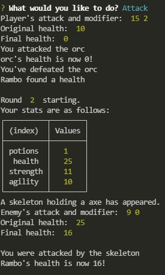

# Jest Another RPG (Role Player Game)
Richard Ay (September 2020, *updated February 2022*)

## Table of Contents
* [Installation Instructions](#installation-instructions)
* [Usage Instructions](#usage-instructions)
* [Application Walk Through](#application-walk-through)
* [Technologies Used](#technologies-used)
* [Deployment Link](#deployment-link)
* [Application Screen Shots](#application-screen-shots)

    
## Installation Instructions
    
     Make sure 'node.js' is installed on your computer. 
  
    
## Usage Instructions
    
    From the GitHub repository, navigate to the /dist subdirectory and issue the command: 'node index'.
  
## Application Walk Through

This application allows the user to create a portfolio of projects.  The Javascript prompts the user for information which is subsequently written to index.html using 'template literals'.  The Javascript takes advantage of the 'rest operator', 'map', and 'filter' to properly populate the HTML template.  The NPM file system package is used to write the index.html file and copy it to the distribution (\dist) directory.  

## Technologies Used

* Node.js
* npm (fs, inquirer, jest)
* Javascript( ..., map, filter, promise)

## Deployment Link
Because this application runs from a machine (command line) and not a browser, it cannot be deployed to GitHub pages.  To run this application, clone it to your local machine and (assuming you have 'node.js' installed) run 'node app.js'.
The link to the GitHub repository is: https://CaptainRich.github.io/portfolio-generator  
 

## Application Screen Shots

 Image of the application with 'mocked' data.  